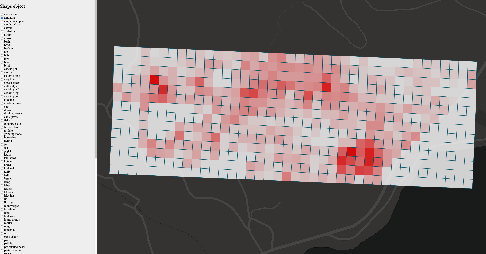
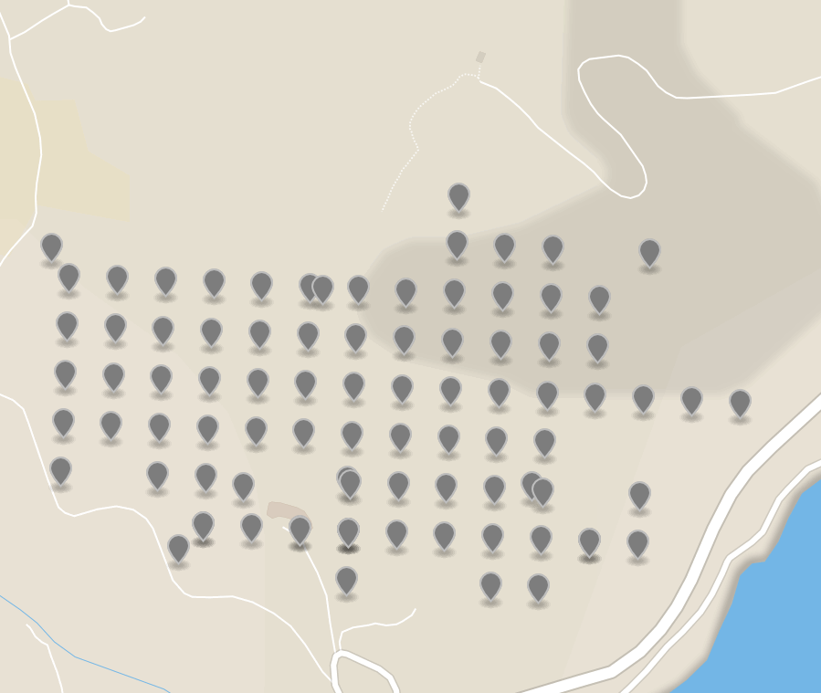
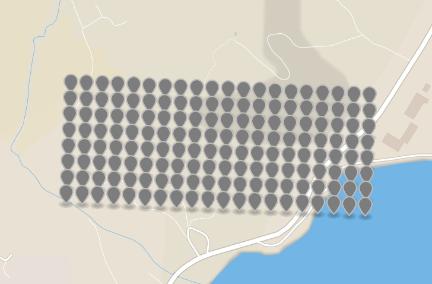
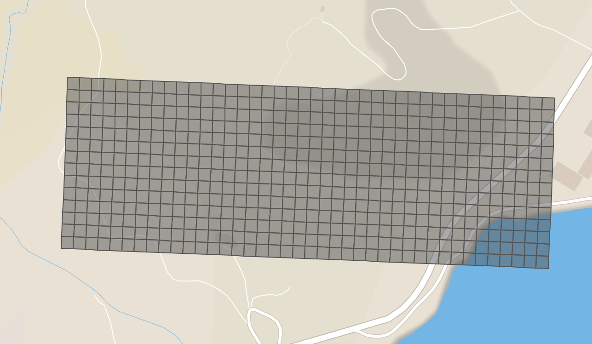
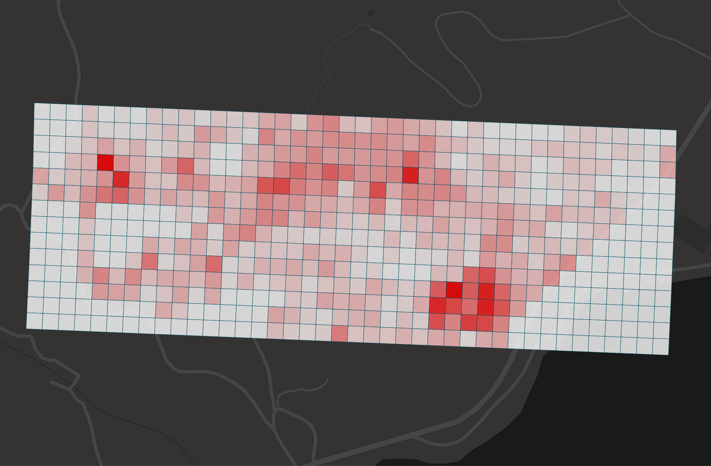

# Repository for Thorikosdash
Dashboard for making data visible and understandable

## Table of contents
* [Demo](#demo)
* [Introduction](#introduction)
* [Grid](#grid)
* [Features](#features)
* [Library's](#library's)
* [Installing](#installing)

## Demo
[](https://app.netlify.com/sites/hungry-hugle-63f43c/deploys)

[Demo Link](https://hungry-hugle-63f43c.netlify.com/)



## Introduction

Project Thorikosdash is focused on bringing usefull insights about the archaeological findings Floris van der Eijnde and his team gathered throughout the years of searching
at Thorikos. Floris and his team searched for fragments inside a grid, the grid tiles are devided in multiple parts. The biggest tile of the grid is 50 meters X 50 meters
which gets devided into 4 tiles of 25 X 25 (these tiles are called mesosquares). These mesosquares get devided again into 4 parts of 12,5 x 12,5. These smallest tiles
of 12,5 by 12,5 get assigned to 1 person who gets to search this "tile" for 20 minutes and document all the shards they find.

## Grid
Below is an image of the geo locations we got from Floris, and as you can see there are a lot of points missing inside this grid.



But what can we do with this information? I began searching for a possible solution to the problem at hand. I searched for ways to calculate with latitudes and longitudes
and found out that you need a few things to start calculating point which are a beginning point, destination point and a bearing (which is the angle between the beginning point and destination point).

With this information i began searching for a library that chould help me calculate all these new locations and bearings. I quickly came across the [ge0lib](https://github.com/manuelbieh/geolib) library which had all the functions i needed
to get started calculating all the grid point locations.

I started gathering all the rows with their begin point and end point and with the help of [ge0lib](https://github.com/manuelbieh/geolib) i started calculating all the points.
Now i had the 50 x 50 meter grid points but i still needed to get the 25 x 25 tiles, so i had to calculate a row in between rows to devide the 50 x 50 tiles into 25 x 25 tiles.

After a lot of strugling i got to this outcome  

### 50x50 points


### 25x25 grid


### Tile names

We also had to give the tiles names so that we whould know where a specific shard had been found inside the grid.
The image below is a visual of how the tiles are named for a 50 x 50 grid. 


We also had to give names to the mesosquares for example tile 196 is devided into part 1 (top left), 2 (top right), 3 (bottom right) and 4 (bottom left)

## Features
### Mapbox
For the background map behind the grid i have used Mapbox so i can switch between map themes and have a nice looking and zoomable map.

```javascript
mapboxgl.accessToken = 'pk.eyJ1IjoiZGFtaWFudmVsdGthbXAiLCJhIjoiY2szNGdvcTA1MG0zYzNibnlyNW1nZWZreSJ9.fUYUVFTp1_PjhZ6HkC0SDQ'
let mapBox = new mapboxgl.Map({
    container: 'mapbox',
    style: 'mapbox://styles/damianveltkamp/ck372eqvz19fl1ctfeghxifun',
    center: [24.054086874072482,37.739184054390634],
    zoom: 16.8
})
```

### Grid 
The grid is formated like a geo.json file with a featurecollection consisting of features to be drawn on a map. So a feature is a tile of the grid.

```json
{
            "type": "Feature",
            "properties": {
                "name": "c/",
                "row": 53,
                "mesoindex": 1
            },
            "geometry": {
                "type": "Polygon",
                "coordinates": [
                    [
                        [
                            24.049985023339868,
                            37.74100146276254
                        ],
                        [
                            24.050269079944552,
                            37.74099192299907
                        ],
                        [
                            24.050263481754197,
                            37.74076713791649
                        ],
                        [
                            24.04997942591854,
                            37.74077667593752
                        ],
                        [
                            24.049985023339868,
                            37.74100146276254
                        ]
                    ]
                ]
            }
        }
```

## Filtering
The filtering feature will get items from the surveyfindings file and nest the results inside the tiles. So we can later do something with these results based on the location it has been found.

Special thanks to Kyle who's filtering script helpt me out a lot to getting mine to work. [Kyle's github](https://github.com/kylebot0)

## Heatmap
After filtering we display the outcome as a heatmap. The amount of found objects will influence the color of a tile and thus give insight into where the hotspots of findings for a specific filter are.

### Outcome 



# Library's
* [ge0lib](https://github.com/manuelbieh/geolib)
* [Mapbox](https://docs.mapbox.com/mapbox-gl-js/overview/?utm_medium=sem&utm_source=google&utm_campaign=sem|google|brand|chko-googlesearch-pr01-dynamicsearchcampaign-nb.broad-all-landingpage-search&utm_term=brand&utm_content=chko-googlesearch-pr01-dynamicsearchcampaign-nb.broad-all-landingpage-search&gclid=CjwKCAiAgqDxBRBTEiwA59eEN1NvSjdnguKL5cLOqcYRouyLv_AQZucv6lpt9k7CEQo92GVt4tER6xoCz0wQAvD_BwE)
* [D3 V5](https://d3js.org/)

# Installing
Clone this repository into your local project folder
```
https://github.com/damian1997/thorikosdash.git
```

Install packages
```
Npm install
```

To run a dev server type this into your terminal when you are inside your project folder
```
npm run dev
```

To serve production files type this into your terminal when you are inside your project folder
```
npm run prod
```

# Honourable mentions
* [Kyle Bot](https://github.com/kylebot0)